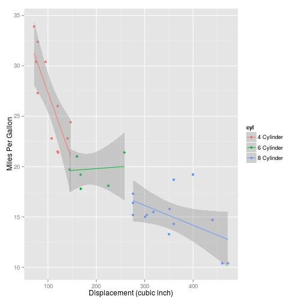

## Interactive MtCars Exploration Tool
This tool can be used to visually explore different pairwise combinations of continous and categorical predictors for "mtcars" dataset

--- .class #id 

## Select Continous Predictor
Select one of the following continous predictors
 * Displacement
 * Gross horsepower
 * Rear axle ratio
 * Weight
 * 1/4 mile time

--- .class #id 

## Select Categorical Predictor

Select one of the following categorical predictors
  * Number of cylinders
  * Engine type (Straight or V-type)
  * Transmission type
  * Number of forward gears
  * Number of carburetors

--- .class #id 

## View Changes in a Plot 

Sample plot for Displacement and Number of cylinders
 

